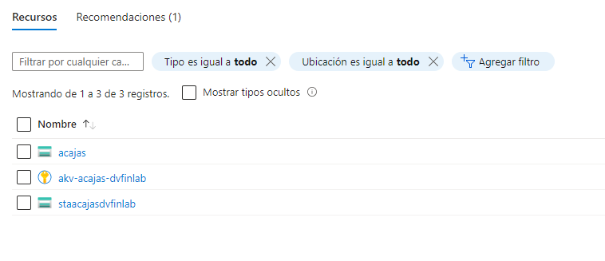

Lo primero es usar el comando `az login` para que te muestre la información de la cuenta.<br><br>
Luego como no tiene permiso la cuenta para crear un `group resources` he creado una cuenta de almacenamiento (`azurerm_storage_account`). Para ello tienes que incluir en el archivo `main.tf` lo siguiente (el campo `name` puedes poner lo que quieras, y en el `resource_group_name` es el nombre del ya creado en la cuenta):
```
resource "azurerm_storage_account" "example" {
  name                     = "acajas"
  resource_group_name      = "rg-acajas-dvfinlab"
  location                 = "West Europe"
  account_tier             = "Standard"
  account_replication_type = "LRS"
}
```
<br>

Una vez hecho esto hay que configurar las variables de entorno de la siguiente manera:
```
export ARM_CLIENT_ID="<APPID_VALUE>"
export ARM_CLIENT_SECRET="<PASSWORD_VALUE>"
export ARM_SUBSCRIPTION_ID="<SUBSCRIPTION_ID>"
export ARM_TENANT_ID="<TENANT_VALUE>"
```
<br>

Para la primera he rederidigido a `sp_list.txt` lo resultante al comando `az ad sp list --all` y he buscado mi nombre (`acajas`).<br>
El segundo se encuentra dentro del `key vault` de nuestro portal de Azure en la sección de `Secretos`.<br>
El tercero y el cuarto nos lo muestra el login que he nombrado antes.<br>
<br>

Para terminar usamos `terraform plan` y `terraform aplly` y nos dirigimos a nuestro portal de Azure para comprobar que nuestra cuenta de almacenamiento se ha creado.<br>

