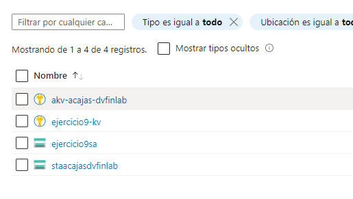
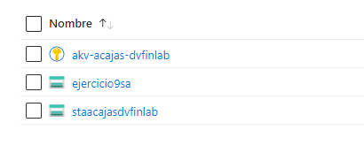

## Primera parte

Creación de los dos recursos: 

A la hora de importar los recursos creados en el `TF1.tf` me ha dado un error diciendome que ejecutase el comando `terraform plan -generate-config-out=generated.tf` , esto me ha generado el archivo `generated.tf` con todas las características de los 2 recursos. No he podido hacer un apply por la variable `soft_delete_retention_days` pero me ha generado el archivo `terraform.tfstate` igual.

 ### Preguntas:
  - Revisa el código. ¿Qué observas? ¿El código generado es exactamente lo que esperabas?
     Veo que en el archivo `generated.tf` ha importado los recursos que he pedido mediante los imports en el archivo `TF2.tf` , la verdad es que esperaba mucha menos información de la obtenida.

  - ¿Qué sucede cuando ejecutas la creación de un recurso que ya existe en Azure pero no está reflejado en el archivo de configuración de Terraform?
     Creo que este error lo he experimentado varias veces a lo largo de hacer los ejercicios, básicamente por lo que entiendo terraform intentará crearlo de nuevo y dará fallo porque ya está creado ya sea por duplicación o conflictos de mismas variables, etc.

## Segunda parte

Para eliminar el Key Vault utilizando el archivo `TF1.tf` tienes que comentar o borrar el código que crea este recurso y ejecutar un `terraform apply` . 

Para eliminar el AKV del `tfstate` he visto en la documentación el siguiente comando `terraform state rm azurerm_key_vault.kv` , pero me ha dado un error que decía que usase `terraform state list` para ver los recursos que había en el `tfstate` y ya he usado `terraform state rm azurerm_key_vault.ejercicio9-kv` para borrarlo. Se puede comparar en el actual y en el backup que lo ha borrado.  

Al aplicar los cambios me ha dado un error porque el AKV seguía estando en el `generated.tf` pero he comentado esa parte del archivo y me ha generado un `terraform.tfstate` nuevo.

### Preguntas:
  - ¿Qué diferencias observas entre el backup del tfstate de TF2 y el resultado de aplicar las operacines previas?
     Que no se encuentra nada del AKV importado.

  - ¿Qué problemática podrías enfrentar en el `tfstate` de un terraform si un recurso de su configuración es eliminado manualmente (sin usar ese terraform)?
     El fallo que he experimentado, estaba borrado del estado pero no del código y daba error porque hacía referencia a algo que no está en el `tfstate`.

  - ¿Qué maneras se te ocurren para comprobar que el `tfstate` refleja el estado real de los recursos?
     Antes de ejecutar un `terraform apply` ejecutar un `terraform plan` y usar el comando `terraform state list` para ver que recursos hay en el `tfstate`.

  - ¿Es necesario mantener los bloques de importación en el archivo `main.tf` de TF2 después de realizar las operaciones anteriores?
     Sí, para gestionar el recurso correctamente en el futuro. 
